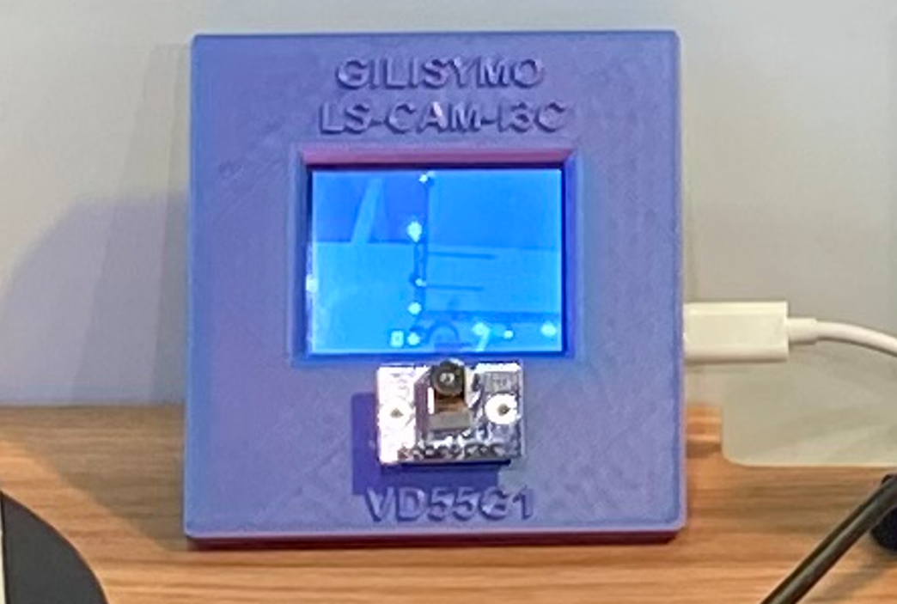
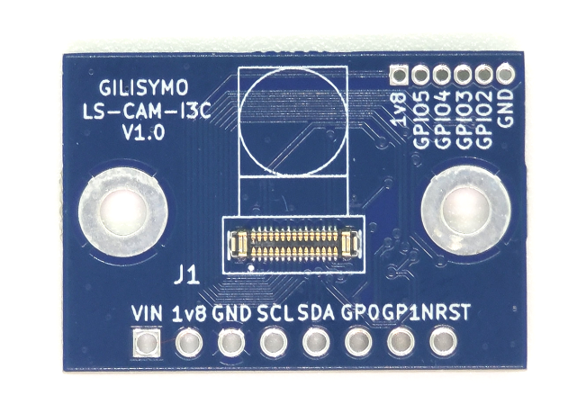

# GILISYMO LS-CAM-I3C STM32 TFT DEMO

The demo has been presented at the Embedded World 2025

 

## GILISYMO LS-CAM-I3C

 

[Find the bord in Gilisymo site](https://www.gilisymo.com/sensors/67-ls-cam-i3c.html)

[Find the VD55G1 in Gilisymo site](https://www.gilisymo.com/sensors/66-cam-vd55g1-160c.html)

## Pinout Description

| Pin | Description                       |
|-----|-----------------------------------|
| 1   | Vin: Input voltage +3.3V or +5V   |
| 2   | 1v8: Output from LDO for Promodule |
| 3   | GND: Ground                       |
| 4   | SCL: I3C Clock                    |
| 5   | SDA: I3C Data                     |
| 6   | GPIO0: GPIO used for LINE interrupt|
| 7   | GPIO1: GPIO                       |
| 8   | NRST: Reset                       |

> **Warning:** In the pre-release PCB version, the pinout silkscreen is not correct.

## Demo Example with NUCLEO-H533RE

This demo example works with the NUCLEO-H533RE. The Light Saber CAM can be connected as follows:

| CN10 Pin | LS CAM Pin |
|----------|------------|
| 3  (PB6) | 4 (SCL)    |
| 5  (PB7) | 5 (SDA)    |
| 7  (AVDD)| 1 (Vin)    |
| 9  (GND) | 3 (GND)    |
| 13 (PA6) | 7 (GPIO1)  |
| 15 (PA7) | 6 (GPIO0)  |
| 17 (PC9) | 8 (NRST)   |

> **Note:** In the [Nucleo User Manual STM32H533](https://www.st.com/resource/en/user_manual/um3121-stm32h5-nucleo64-board-mb1814-stmicroelectronics.pdf) (page 28), you can find the description of the pin assignment of the ST morpho connector.

> **Warning:** Keep the connections short, or the demo will hang. Alternatively, you can slow down the I3C clock frequency. However, in that case, reading from the device will take more time, and the display will not have time to update.

## Display Information

The display used is the SPI 2.8" TFT 240x320 with an ILI9341 controller. In the bottom you can find the pin name. Please connect as follow:

| CN7 Pin  | SPI TFT Pin |
|----------|-------------|
| 18  (5V) | 1 (VCC)     |
| 20  (GND)| 2 (GND)     |
| 36  (PC1)| 4 (RESET)   |
| 18  (5V) | 8 (LED)     |

| CN10 Pin | SPI TFT Pin  |
|----------|--------------|
| 33 (PC8) | 3 (CS)       |
| 31 (PB3) | 5 (DC/RS)    |
| 37 (PB15) | 6 (SDI/MOSI)|
| 25 (PB10) | 7 (CLK)     |
| 35 (PB14) | 9 (SDO/MISO)|

You can find the equivalents on Arduino connectors.

## Gilisymo information

Gilisymo website: https://www.gilisymo.com/
Gilisymo contact: contact@gilisymo.com

